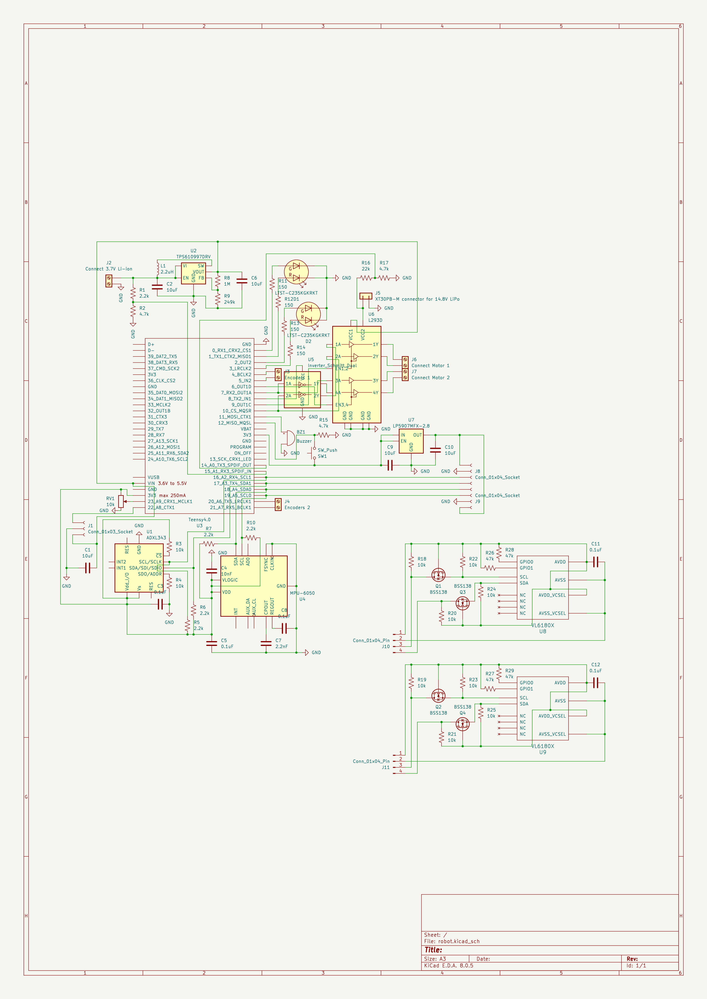
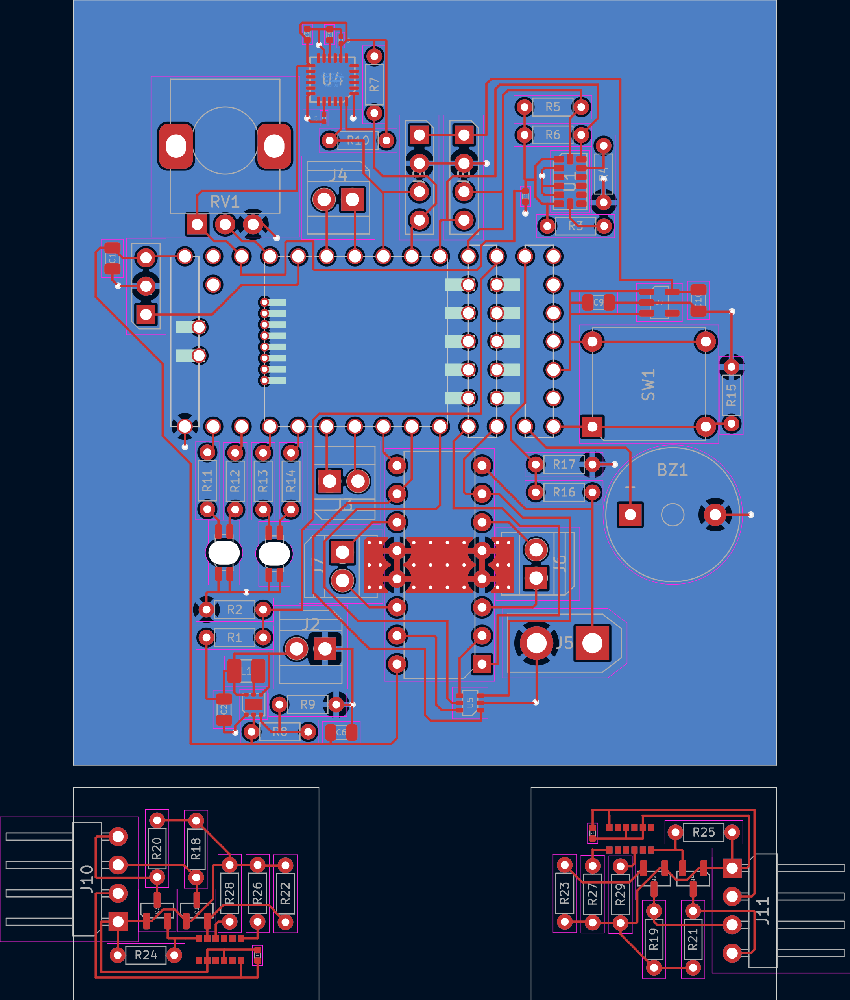
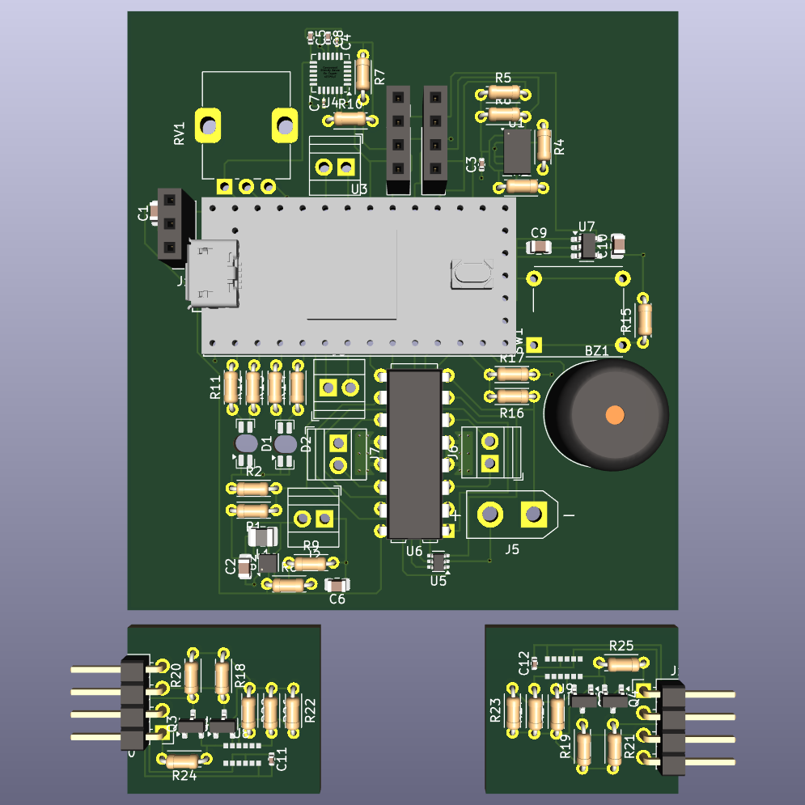

# Obstacle avoiding robot

A common type is the micromouse, a small robot which tries to solve a maze. I.e., it tries to reach the center of a maze made up of a 16×16 grid of cells, each 180 mm square with walls 50 mm high.

## Usage

Clone the repo and open with KiCAD.

## Schematic



## Parts

While picking parts, ensure that the voltage/current/power ratings of componenets are not exceeded. Also, lithium cells have a nominal voltage of 3.7V (although it can go up to 4.2V when fully charged, and can be discharged until 3V), so their batteries are going to be multiples of the same.

### Microcontroller – Teensy 4.0

https://www.pjrc.com/store/teensy40.html

The Teensy 4.0 is compatible with the Arduino software, smaller than the Nano, and more powerful than the Giga (2x the CoreMark score). It needs a 5V supply voltage, so we'll use a 3.7V Li-ion battery with A TPS61099x 5V boost converter.

#### Why not older models?

> PJRC recommends use of Teensy 4.0 / 4.1 for new projects. We do not believe supply of chips for Teensy 3.x is likely to ever fully recover. These chips are made with 90 nm silicon process. Most of the world's semiconductor fabs are focusing on 45 nm or smaller, leaving limited supply for older chips. We anticipate the cost of these chips is likely to increase as the supply continues to dwindle.
>
> www.pjrc.com/store/teensylc.html

Thus we use the 4.x series to future-proof our design. The 4.0 is the smaller model of the series and is sufficient for our project.

### Motors – N20 gear motors, driven by the L293D

We will use the common N20 gear motor. To pick the specifications of the same, let's make use of this [Drive Motor Sizing Tool](https://community.robotshop.com/blog/show/drive-motor-sizing-tool)
```
Total mass: 210g                 When picking components, we should keep the total weight at or below this.
Number of drive motors: 2        Each of the rear wheels will have a sepaarte motor, turning will be achieved by driving them at different speeds.
Radius of drive wheel: 32.5 mm   Use 65 mm RC wheels
Robot velocity: 1.35 m/s         Micromice can run at over three meters per second, depending on the maze design.
Maximum incline: 0 deg           A simple maze solving robot doesn't need to worry about performance climbing inclines.
Supply voltage: 12 V             12V is the highest available voltage for the N20. A higher voltage means less current/charge is required for the same power/energy output. 
Desired acceleration: 4 m/s2     Micromice can run with forward acceleration and braking well over 1g.
Total efficiency: 40%            N20 motors have a maximum efficiency of around 0.4
```
```
Angular Velocity: 396.86 rpm
Torque: 0.34786 kgf-cm
Total Power: 1.4175 W
Maximum current: 118.13 mA
```
The [N20 motor rated for 12V 400RPM](https://robu.in/product/n20-12v-400-rpm-micro-metal-gear-motor) fulfils these requirements. It has a rated torque of 0.35 kg-cm. The recommendation for brushed DC motor operation is 25% or less of the stall current. The stall current for the above motor is 0.75 A, and the required current of 118.13 mA is less than 16% of it.

Make sure to buy the version with a [motor encoder](https://www.pololu.com/product/5215) and [its wires](https://www.pololu.com/product/4762) – it tells us how much the motor has rotated and thus the robot's speed as well as the distance travelled.

With these motors, we will use a pair of [65mm RC wheels](https://srituhobby.com/product/65mm-rubber-wheel-rc-model-tire).

On the [L293D motor driver](https://www.electronicscomp.com/l293d-dual-h-bridge-motor-driver-ic), there are two pins to control the direction of each motor as follows:
| IN1	| IN2 |	Spinning Direction |
| --- | --- | --- |
| LOW | LOW| Motor OFF |
| HIGH	| LOW | Forward |
| LOW | HIGH | Backward |
| HIGH	| HIGH |	Motor OFF |

The enable pin for each motor can be used to switch it on/off (as well as control the speed using PWM) so the `LOW,LOW` and `HIGH,HIGH` configurations are not needed. As for the remaining two, we can save two digital pins (one per motor) by using a logic inverter. Thus we use the Dual Schmitt-Trigger Inverter, but since we have a pin to spare, we end up using a digital pin for the inverter supply voltage (instead of the 3.3V pin) to simplify the connections.

The L293D will drop the motor supply voltage by ~2.6V, so we will use a 14.8V LiPo battery for the motors.

### Accelerometer – ADXL345

Calculating the position of the robot from the rotation of the motor is complicated by turns of the robot, and some slipping can mess up the entire calculation thereafter. Thus we make use of an accelerometer.

### Gyroscope - MPU6050

Similarly, a gyroscope tells us how many degrees the robot has turned.

<table><td><b>NOTE</b>: Both the ADXL345 and the MPU6050 are I2C devices and thus we use 2.2k pull-up resistors on the SDA and SCL connections because the Teensy's internal pull-up resistors are too weak.</td></table>

### Distance sensors

Note that distance sensors have a dead zone or blanking distance of say, x cm, beginning from the face of the sensor and extending outward, within which it cannot measure distances. One can simply position the sensor x cm inwards on the robot if they wish to measure distances in that zone.

#### Front - Sharp GP2Y0A41SK0F

https://www.pololu.com/product/2464

The GP2Y0A41SK0F is an IR sensor with a range of 4 – 30 cm. Considering the size of the robot and its enclosings, this is a good range within which to detect obstacles so the robot can decide if and how much to speed up, slow down, or stop, and can do so in time. A simple calculation is that if the robot is moving at its maximum speed of 1.35 m/s and has a maximum acceleration (deceleration in this case) of 4 m/s2, it can come to a stop within a distance of v²/2a = 22.8 cm.

This sensor draws current in large, short bursts, which is why we should (and do) place a 10 µF capacitor or larger across the 5V supply and ground, close to the sensor.

The sensor will be stuck to the front of the robot and a [3-Pin Female JST-PH Cable with male pins](https://www.pololu.com/product/1799) will be used to connect it to 0.1" female pins on our PCB.

#### Sides – VL6180X

https://www.pololu.com/product/2489

The sides of the robot will approach closer to walls and obstacles than the front, so a shorter minimum range is required. The VL6180X is a time-of-flight ranging sensor with a range of 1 – 20 cm (or 60 cm with reduced resolution), which is sufficient. It uses 2.8V logic, so we use the LP5907MFX-2.8 linear voltage regulator to convert 3.3V to 2.8V.

It is an I2C device, and we use 10k pull-up resistors on the SDA and SCL connections. Its I2C address will reset to 0x29 when powered off and on again, so for simplicity, we let the two chips have identical addresses and instead connect them to different SDA/SCL pins on the microcontroller.

Each chip (with its associated componenets) will be on a separate board that will be stuck to the side of the robot, and connected to the main PCB via common 0.1" pins and jumper cables.

### RG bicolor LEDs – LTST-C235KGKRKT

We use voltage dividers to supply a fraction of the two batteries' voltages to analog pins on the Teensy. Based on these, the microcontroller can make two corresponding bicolor LEDs display hues from green to yellow to red, to indicate the charge. An LED can blink red when the level is danngerously low, and blink green when its corresponding battery is done charging. The LED is rated for 20mA but the Teensy's pins have a limit of 10mA. The voltage supplied to the LED will always be 3.3V, the brightness will be controlled using PWM. The LED forward voltage is 2V. Thus the value of the current limiting resistor used should be at least (3.3−2)/0.01 = 130 ohms, so let's use a standard 150 ohm resistor.

### Buzzer – AI-3035-TWT-3V-R

We can have the buzzer buzz at different frequencies and beep at different delays to notify us of various things. Its rating of 3V,9mA is within the limits of the Teensy pin. For every doubling of distance, the sound level reduces by 6dB, so its volume of 100dB@10cm means that our buzzer will have a nicely audible volume of 60dB 10m away.

**TODO**: Due to laziness, the PCB currently uses KiCAD's standard 12x9.5mm buzzer footprint, which should be replaced with a custom but more accurate 30x20mm one – this means the PCB will be larger than it currently is.

### Potentiometer – RK09K or similar

We'll use a 10k rotary potentiometer (vertical) with a knob to provide an analog voltage that indicates the speed at which we want the robot to move.

### Switches

We need two switches. First, an SPST rocker switch connected (not on the PCB) to the 3.7V battery to just switch on the circuitry, perhaps to check the working status of the components, battery level, etc. Then a normally open SPST Push button switch, like the MEC 5GTH935, to signal that the robot should start moving. Normally the Teensy pin is pulled down to ground, but when the switch is pressed, it momentarily becomes HIGH, and upon receiving this signal, the microcontroller starts the robot's motion.

### 2 Pin Screw Terminals – Xinya XY308-2P 2.54MM

In total, we require five [2 pin screw terminals](https://www.tme.com/in/en/details/xy308-2p-2.54-gn/pcb-terminal-blocks/xinya/xy308-2p-2-54mm-green) to connect various unterminated wires to the PCB.

### Batteries

| Part | Weight (g) | Voltage (V) | Current (mA) |
| --- | --- | --- | --- |
| 1 x Teensy 4.0 | 2.8 | 5 | 100 |
| 2 x N20 | 12 | 14.8 | 118 |
| 2 x wheels | 31 | - | - |
| 1 x L293D | 2.1 | 5 | 24 |
| 1 x ADXL345 | 0.03 | 3.3 | 0.04 |
| 1 x MPU6050 | 0.03 | 3.3 | 3.6 |
| 1 x GP2Y0A41SK0F | 3.5 | 5 | 12 |
| 2 x VL6180X (with LP5907MFX) | 0.03 | 3.3 | 25 |
| 2 x (LTST-C235KGKRKT + 150ohm) | 0.04 | 3.3 | 8.67 |
| 1 x AI-3035-TWT-3V-R | 12 | 3 | 9* |
| 1 x RK09K | 4.5 | 3.3 | 0.33 |
| 1 x Rocker Switch | 1.4 | 0 | - |
| 1 x 5GTH935 | 3 | 3.3 | 0.7* |
| 5 x XY308-2.54 | 0.5 | 0 | - |

`*` – current flows rarely

Adding all the weights, we get 112g. For the batteries, let's pick the [3.7V 3.7Wh 1000mAh LiPo](https://www.lithium-polymer-battery.net/lp543450-3-7v-1000mah-3-7wh-lithium-polymer-battery)  (20g) and the [Orange 14.8V 360mAh 25C 4S LiPo](https://robu.in/product/orange-360mah-4s-25c-14-8-v-lithium-polymer-battery-pack-li-po) (60g). This brings the weight up to 192g, but this is excluding the PCB material, wires, connectors, and small circuit elements. A PCB weighs a couple grams per square inch – see [custompcb.com/faq.php](https://custompcb.com/faq.php) – so the final weight should come out to around 210g.

The 14.8V Lipo is 25C, so can deliver a maximum current of 0.36Ah * 25h^(-1) = 9A, which is more than enough for our motors. They draw upto 2 * 118mA = 236 mA, so our battery will last 360mAh / 236 mA = 1.5h, if the robot was continuously running at full power, but in reality, will last longer.

The following diagram shows the flow of current from the 3.7V LiPo.
```
------------------------------------ 3.7V
               |
      301.2 mA (1114.5 mW)
               |
      ----------------------
      | TPS61099 (93% eff) |
      ----------------------
               |
---------------|-------------------- 5V
               |
      207.3 mA (1036.5 mW)
               |
      -------------------
      |                 |
      |              171.3 mA
      |                 |
 --------------  -------|------------------
 | 5V Devices |  |      |                 |
 --------------  |  ----------            |
      |          |  | Teensy |            |
      |          |  ----------            |
    36 mA        |   |      |             |
      |          |   |   ---|--- 3.3V     |
      |          | 100mA    |             |
      |          |   |   ---------------- |
      |          |   |   | 3.3V Devices | |
      |          |   |   ---------------- |
      |          |   |      |             |
      |          ----|------|--------------
      |              |      |
      |              |    71.3 mA
      |              |      |
      V              V      V
------------------------------------ GND
```

The 3.7V LiPo has a max continuous discharge current of 1000 mA so it will be able to provide our required current of 301.2 mA. It is a 3.7 Wh battery, so it will last 3.7Wh/1114.5mW = 3.3h.

## PCB

For a 1 oz copper thickness PCB, KiCAD's default trace width of 0.200mm is sufficient for the amount of current in our circuit, and so are the default 0.6/0.3 mm vias. We must also make sure to maintain some clearance betweeen traces, to prevent crosstalk. The routing in our PCB is tight at places, which is why our ground plane is important in that it reduces crosstalk.

From Wikipedia:
>  When two traces run parallel, an electrical signal in one can be coupled into the other through electromagnetic induction by magnetic field lines from one linking the other; this is called crosstalk. When a ground plane layer is present underneath, it forms a transmission line with the trace. The oppositely-directed return currents flow through the ground plane directly beneath the trace. This confines most of the electromagnetic fields to the area near the trace and consequently reduces crosstalk.


<br>

